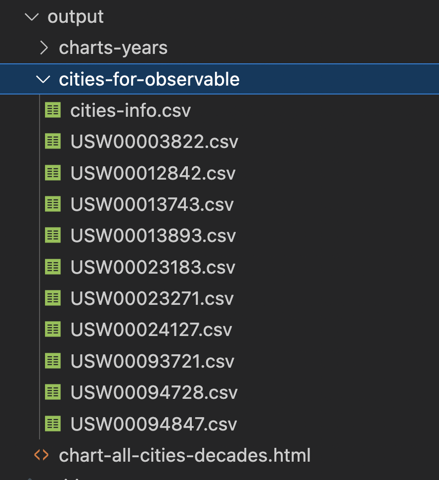
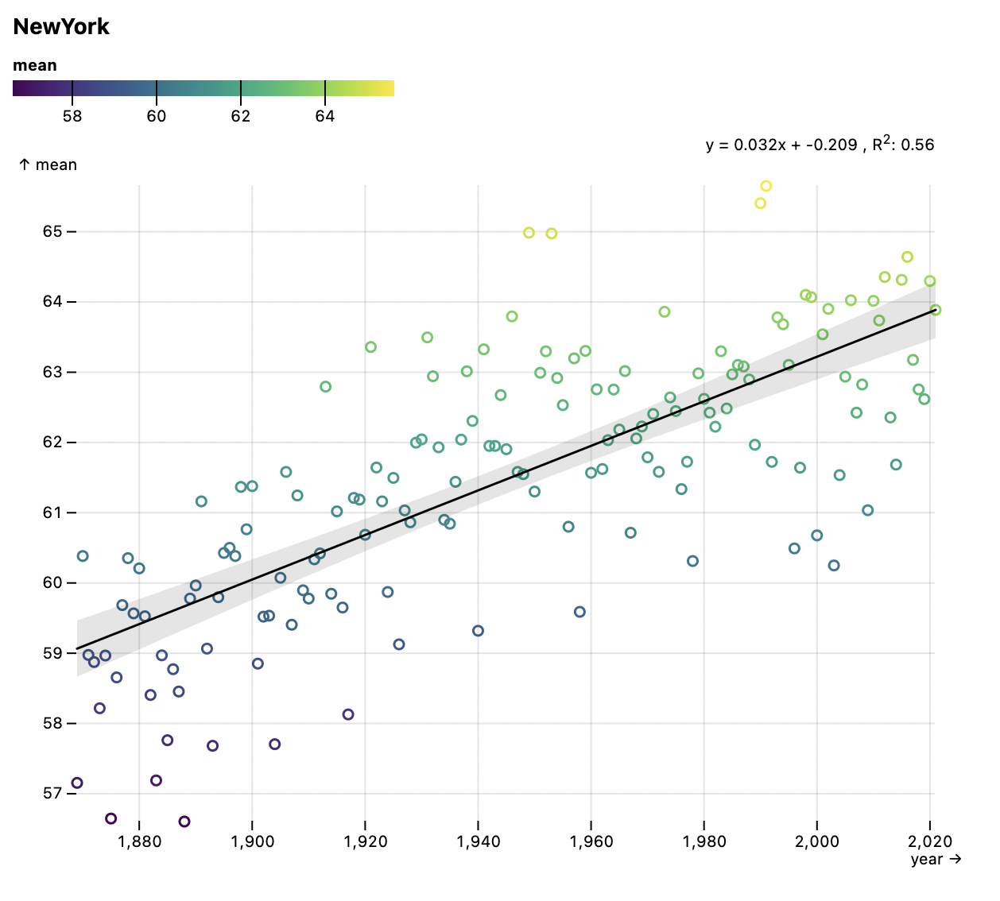
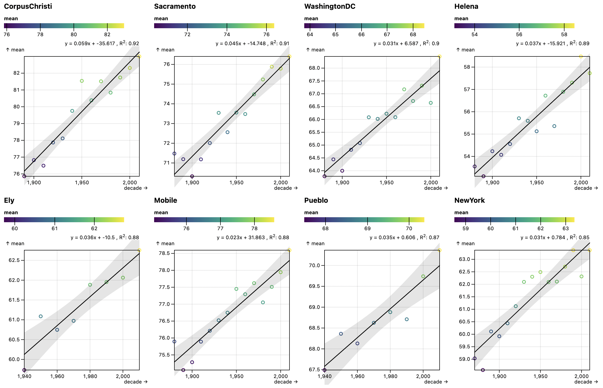
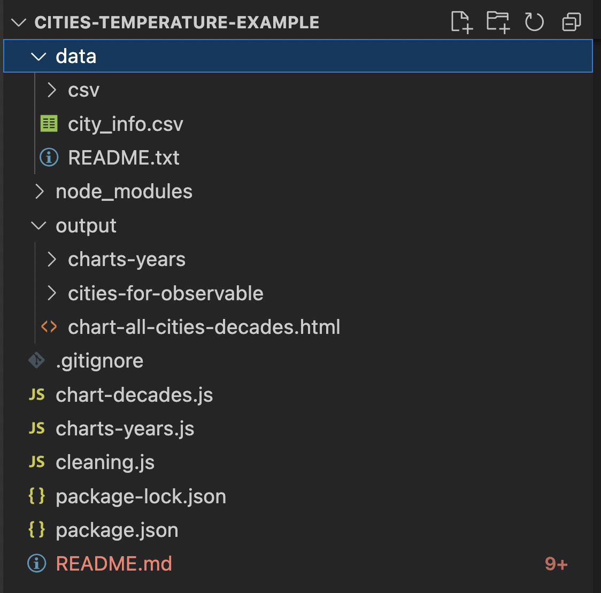

This repository showcases how to use the [simple-data-analysis](https://github.com/nshiab/simple-data-analysis.js) library with Node.js, for teaching purposes. It's related to this [Observable notebook](https://observablehq.com/@nshiab/climate-change-in-us-cities-example).

The data used in this repo comes from the
[Compiled historical daily temperature and precipitation data for selected 210 U.S. cities](https://kilthub.cmu.edu/articles/dataset/Compiled_daily_temperature_and_precipitation_data_for_the_U_S_cities/7890488) by Yuchuan Lai and David A. Dzombak from Carnegie Mellon University.

It consists of 210 CSV files with historical daily temperatures. Each file contains the data for one American city. For some dates, data is missing. In total, it's around 10 million rows of data.

There are three scripts that output files in the [./output/](https://github.com/nshiab/cities-temperature-example/tree/main/output) directory.

- `cleaning.js`: this script creates files to be used in this [Observable notebook](https://observablehq.com/@nshiab/climate-change-in-us-cities-example), for teaching purposes. For a few hand-picked cities, CSV files are generated in [./output/cities-for-observable/](https://github.com/nshiab/cities-temperature-example/tree/main/output/cities-for-observable). The name of the cities is in a different file called cities-info.csv, in the same folder.

- `charts-year.js`: this script loads the cities' CSV files one by one. It cleans and restructures the data before creating a chart for the city. The output is one chart saved as an HTML file for each city in [./output/charts-years/](https://github.com/nshiab/cities-temperature-example/tree/main/output/charts-years). You can check preview them by prepending their URL with https://htmlpreview.github.io/?. For example, here's the link for the [New York html chart](https://github.com/nshiab/cities-temperature-example/blob/main/output/charts-years/NewYork.html) and here's the [prepended link to preview it](https://htmlpreview.github.io/?https://github.com/nshiab/cities-temperature-example/blob/main/output/charts-years/NewYork.html). You can also download the files and open them in your browser, of course.

- `charts-decade.js`: this script opens all of the CSV files and loads all of the data once. It cleans and restructures the data. It also filters out cities without enough data points. Finally, it creates small multiple charts with cities ordered from the strongest temperature trend to the lowest. The output is one [HTML file](https://github.com/nshiab/cities-temperature-example/blob/main/output/chart-all-cities-decades.html), with multiple charts in it. You can [preview it here](https://htmlpreview.github.io/?https://github.com/nshiab/cities-temperature-example/blob/main/output/chart-all-cities-decades.html) or save and open it in your browser.

Usually, we don't push the output of the code on GitHub, but since this repository is for teaching purposes, I want you to be able to see the result, even if you might not run the code.

However, I strongly suggest that you try to run it!

To do so, you first need to clone this repository (or download it).

Then make sure that you have [Node.js](https://nodejs.org/en/) installed. If you don't know, just try what's below. If it doesn't work, you probably don't have Node!

Open the cloned repository in [VS Code](https://code.visualstudio.com/), open the terminal and type "npm install". That will install the same version of simple-data-analysis and other libraries that I used.

Now, you need to download the data. Open [this link](https://kilthub.cmu.edu/articles/dataset/Compiled_daily_temperature_and_precipitation_data_for_the_U_S_cities/7890488) and click on download all. It's a pretty big file. Unzip it. Create a folder "data" at the root of the repository. And then a "csv" folder in "data". Move all the files in "csv", except "city_info.csv" and "README.txt". These last two, you have to put them in "data", but not in "csv".

Your file structure should look like this (with the CSV files in "csv").

Then, in the terminal, type `node cleaning.js`, `node charts-years.js` or `node chart-decades.js` to run the script of your choice.

You should see your computer happily crunching data and logging things in the console!

Have fun! :)
